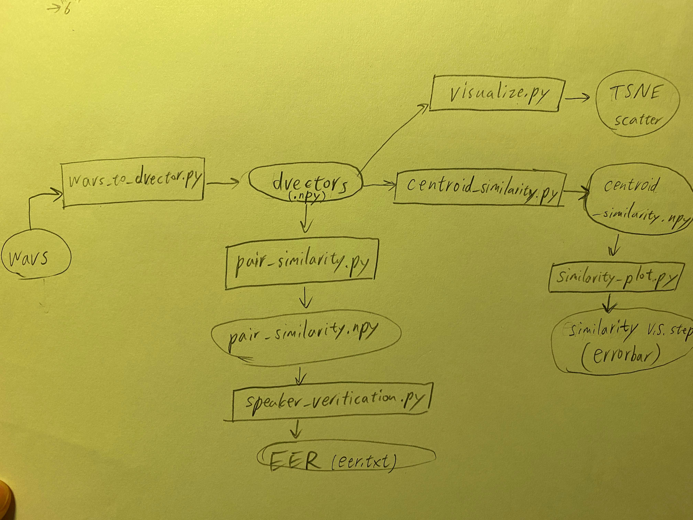

# Evaluation_for_TTS

For MOS prediction of [Utilizing Self-supervised Representations for MOS Prediction](https://arxiv.org/abs/2104.03017),
we asked the authors for the code, but since the code is not yet publicly released, we could not provide it here.
To get the code, please contact its authors.

## Prepare
- Install [speechmetrics](https://github.com/aliutkus/speechmetrics.git) for
  MOSNet:
```bash
git clone https://github.com/aliutkus/speechmetrics.git
cd speechmetrics
# bash
pip install -e .[gpu]
# zsh
pip install -e .\[gpu\]
```
- Download [Pytorch_MBNet](https://github.com/sky1456723/Pytorch-MBNet.git) for MBNet:
```bash
git clone https://github.com/sky1456723/Pytorch-MBNet.git
```
- Fix paths and configurations in `config.py`
- Prepare output directories
```bash
mkdir -p npy/LibriTTS
mkdir -p npy/VCTK
mkdir -p csv/LibriTTS
mkdir -p csv/VCTK
```

## MOS prediction
```bash
python compare_mos.py --net <mosnet/mbnet>
```

## Speaker adaptation metrics

